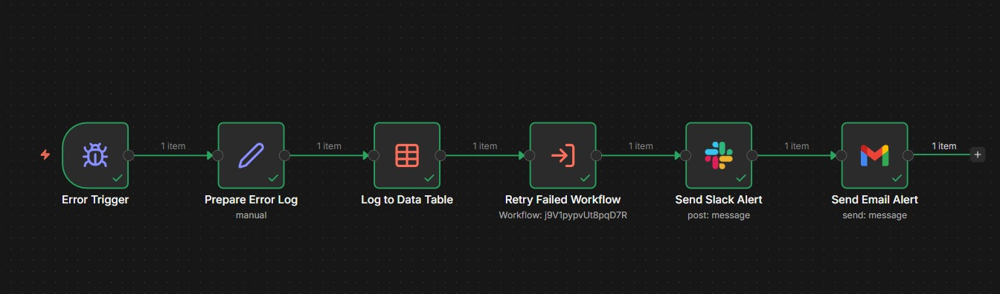
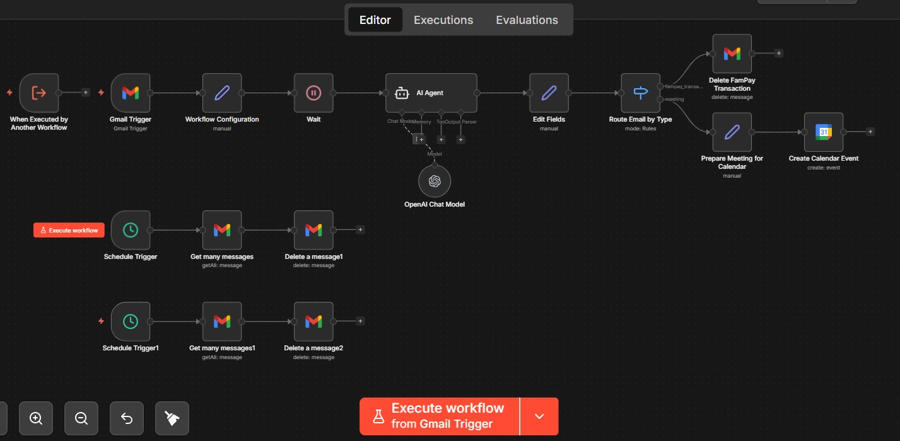

# 🚀 AI-Powered Gmail Automation System (n8n + OpenAI)

An AI-driven email automation system that processes Gmail messages, performs intelligent actions, and ensures reliability with a fault-tolerant error handling workflow.

---

## 📸 Workflow Preview

## 📌 Project Overview

This project consists of two core workflows:

- MyWorkFlow.json → Handles email processing and automation  
- ErrorFlow.json → Manages error handling, logging, retry, and alerts  

Together, they form a scalable, event-driven automation system.

---

## ⚙️ Core Features

### 💬 Email Automation (MyWorkFlow.json)
- AI-based email classification using OpenAI  
- Automatic deletion of spam/transactional emails  
- Smart routing of emails based on content  
- Meeting scheduling via Google Calendar  
- Scheduled workflows for inbox cleanup  

---

### 🚨 Error Handling & Reliability (ErrorFlow.json)
- Centralized error handling workflow  
- Logs errors for monitoring and debugging  
- Automatic retry mechanism for failed executions  
- Real-time alerts via Slack and Email  
- Ensures fault-tolerant automation  

---

## 🔄 Workflow Architecture

Gmail Trigger → AI Processing → Routing → Action
↓
Error Handling Flow

---

## 🛠️ Tech Stack

- **Automation:** n8n  
- **AI:** OpenAI API  
- **Email:** Gmail API  
- **Scheduling:** Google Calendar API  
- **Notifications:** Slack API  

---

## 📂 Project Structure

GMAIL-AUTOMATION/
│── MyWorkFlow.json # Main automation workflow
│── ErrorFlow.json # Error handling workflow
│── LICENSE
│── README.md

---

## 🚀 How to Use

1. Import `MyWorkFlow.json` into n8n  
2. Import `ErrorFlow.json` into n8n  
3. Configure credentials:
   - Gmail API  
   - OpenAI API  
   - Slack (optional)  
   - Google Calendar  
4. Activate workflows  

---

## 🧠 Key Learnings

- Designed AI-powered automation pipelines  
- Built event-driven workflows with real-time processing  
- Implemented fault-tolerant systems with retries & logging  
- Integrated multiple APIs into a unified workflow  

---

## 🔮 Future Improvements

- Add dashboard for monitoring logs  
- Improve AI classification accuracy  
- Add multi-user support  
- Add analytics for email insights  

---

## 📄 License

This project is licensed under the MIT License.

